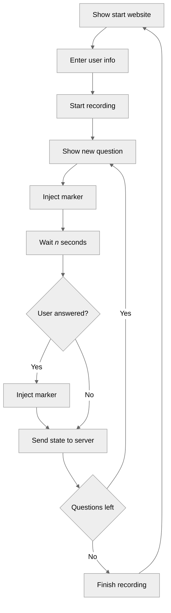

Stimulus website flow:

```mermaid
%%{init: {'theme':'neutral'}}%%
flowchart TD
    A[Show start website] --> B[Enter user info]
    B --> C[Start recording]
    C --> D[Show new question]
    D --> H["`Inject marker`"]
    H --> E["`Wait _n_ seconds`"]
    E --> I{User answered?}
    I --> |Yes| J["Inject marker"]
    J --> K[Send state to server]
    I --> |No| K
    K --> F{Questions left}
    F --> |Yes| D
    F --> |No| G[Finish recording]
    G --> A
```