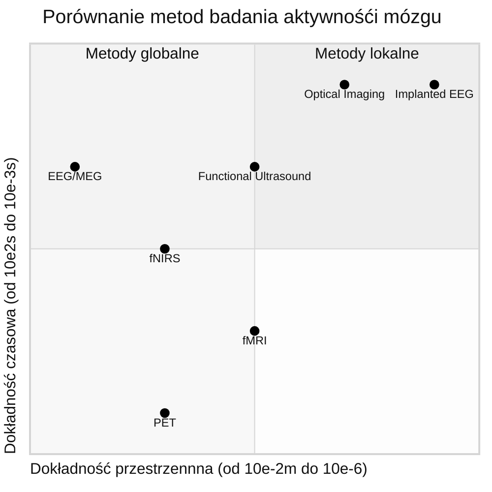

Porownanie metod badania aktywnosci mozgu

```mermaid
%%{init: {'theme':'neutral'}}%%
quadrantChart
    title Porównanie metod badania aktywnośći mózgu
    quadrant-1 Metody lokalne
    quadrant-2 Metody globalne
    x-axis "Dokładność przestrzennna (od 10e-2m do 10e-6)"
    y-axis "Dokładność czasowa (od 10e2s do 10e-3s)"
    Implanted EEG: [0.9, 0.9]
    Optical Imaging: [0.7, 0.9]
    Functional Ultrasound: [0.5, 0.7]
    EEG/MEG: [0.1, 0.7]
    PET: [0.3, 0.1]
    fMRI: [0.5, 0.3]
    fNIRS: [0.3, 0.5]
```